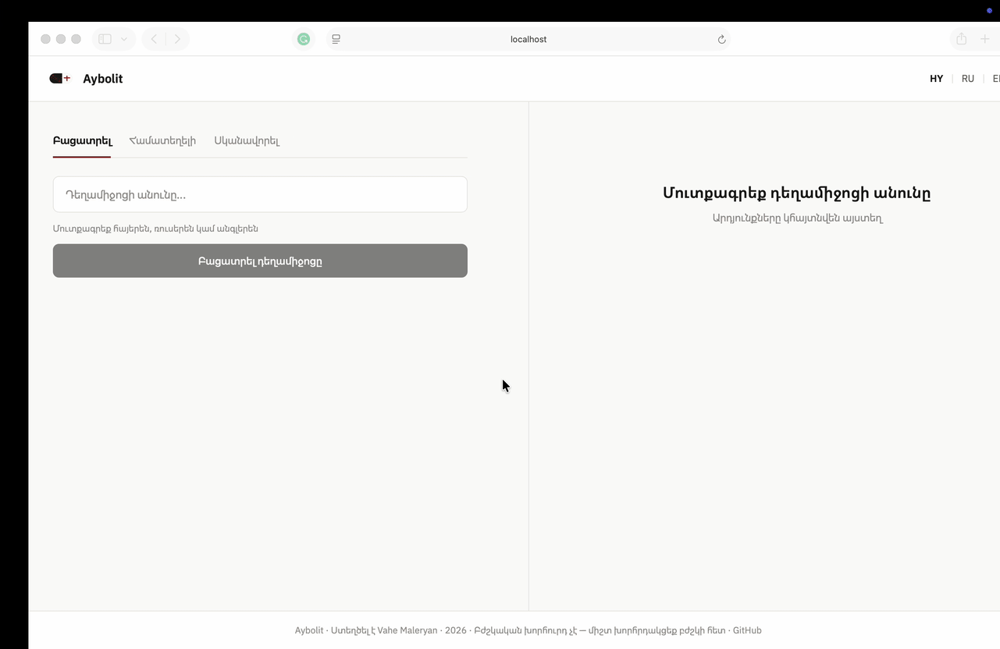

# Aybolit · Այbolit

> Armenian medication assistant — explains any medication in Armenian and Russian
> with structured dosage, severity-tagged side effects, drug-interaction checking,
> and a medicine-box photo scanner.

[](https://www.python.org/)
[](https://fastapi.tiangolo.com/)
[](https://react.dev/)
[](https://groq.com/)
[](LICENSE)

---

## Demo



### Example 1 — Phonetic typo

```
Input:  paratsetamol   (language: hy)

Did you mean:  Paracetamol
Source:        openFDA + Groq (rag_used: true)
Doctor signal: Monitor symptoms

Armenian:  Պարացետամոլը ցավի և տենդի դեղ է...
Russian:   Парацетамол — обезболивающее и жаропонижающее средство...

How to take:
  Dose       1-2 հաբ
  Frequency  Ամեն 6-8 ժամ
  With food  Ցանկալի է
```

### Example 2 — Russian Cyrillic brand name

```
Input:  Нурофен   (language: hy)

Matched:        Ibuprofen   (via tier-1 catalog — brand: Nurofen / Нурофен)
Medication:     painkiller, OTC
Doctor signal:  Monitor symptoms

Side effects:
  · stomach pain (moderate)
  · dizziness (mild)
  · allergic reaction (severe)
```

### Example 3 — Drug interaction

```
Input:  Aspirin  +  Warfarin   (language: en)

Verdict:        Caution — monitor symptoms
Severity:       moderate
Source:         RxNorm + Groq

Recommendation: Combining aspirin with warfarin significantly
increases bleeding risk. Consult your doctor before combining.
```

### Example 4 — Medicine-box photo

```
Input:  [photo of medicine box]

Detected:       Aspirin
Strength:       500 mg
Form:           tablet
Manufacturer:   Bayer
Active:         Aspirin
Backend:        groq_vision   (1.1 s)

→ Click "Explain this medication" to jump to the Explain tab
  with the detected name pre-filled.
```

---

## Features

- **Understands any input** — Armenian, Russian, English, typos, brand names,
  Cyrillic, Armenian script, mixed script, phonetic Latin spellings
- **Bilingual explanations** in simple Armenian + Russian
- **Structured dosage card** — dose / frequency / with food
- **Severity-tagged side effects** (mild / moderate / severe)
- **Doctor signal** — routine / monitor / call doctor / emergency
- **Drug-interaction checker** against the NIH RxNorm database
- **Medicine-box scanner** — upload a photo, get the medication name
  and auto-explain in one click
- **RAG-grounded answers** — every response is backed by retrieval from
  the OpenFDA label database; the response carries citations
- **3-layer name detection** — curated tier-1 catalog → OpenFDA dynamic →
  AI knowledge fallback

---

## Architecture

```
            ┌────────────────────────────────┐
   User ──▶ │ Frontend (React + Vite)        │
            │  Explain / Interaction / Scan  │
            └──────────────┬─────────────────┘
                           │ HTTP
                           ▼
            ┌────────────────────────────────────────────────────────────┐
            │ FastAPI (api/main.py)                                      │
            │                                                            │
            │  /explain                                                  │
            │    ├─ Tier-1 name match    rapidfuzz + transliterate       │
            │    │      (73 medications, 524 variants)                   │
            │    ├─ OpenFDA dynamic      if not in tier-1, try FDA       │
            │    ├─ OpenFDA label fetch  (real drug label data)          │
            │    ├─ RAG retrieve         ChromaDB + multilingual MiniLM  │
            │    └─ Groq LLM             llama-3.3-70b-versatile         │
            │                                                            │
            │  /interaction              RxNorm + Groq                   │
            │  /ocr                      Groq Vision or Tesseract        │
            │  /search                   OpenFDA autocomplete            │
            └────────────────────────────────────────────────────────────┘
```

---

## Local Setup

### Prerequisites
- Python 3.13
- Node.js 18+
- A Groq API key — free at [console.groq.com](https://console.groq.com)

### Installation

**1. Clone**
```bash
git clone https://github.com/VaheMaleryan/aybolit
cd aybolit
```

**2. Backend**
```bash
python3 -m venv venv
source venv/bin/activate
pip install -r requirements.txt
```

**3. Frontend**
```bash
cd frontend && npm install && cd ..
```

**4. Run (two terminals)**

Terminal 1 — backend:
```bash
export GROQ_API_KEY="your-key-here"
uvicorn api.main:app --reload --port 8000
```

Terminal 2 — frontend:
```bash
cd frontend && npm run dev
```

**5. Open**
```
http://localhost:5173
```

### Optional — better OCR (local Tesseract)

By default the medicine-box scanner uses Groq Vision (cloud). For better
Armenian + Russian text recognition, install Tesseract locally:

```bash
# macOS
brew install tesseract tesseract-lang

# Debian/Ubuntu
sudo apt-get install tesseract-ocr tesseract-ocr-hye tesseract-ocr-rus

# enable local mode
export AYBOLIT_LOCAL=true
```

`AYBOLIT_LOCAL=true` also switches RAG storage from in-memory (rebuilt at every
startup) to a persistent ChromaDB at `/tmp/aybolit_chroma`.

---

## API Reference

| Method | Endpoint        | Description                          |
| ------ | --------------- | ------------------------------------ |
| POST   | `/explain`      | Explain a medication                 |
| POST   | `/interaction`  | Check a drug interaction             |
| POST   | `/ocr`          | Scan a medicine-box photo            |
| GET    | `/search?q=`    | Autocomplete drug names              |
| GET    | `/health`       | Health check + config status         |
| GET    | `/stats`        | Query counts, uptime, RAG state      |

Example:
```bash
curl -X POST http://localhost:8000/explain \
  -H "Content-Type: application/json" \
  -d '{"drug_name": "парацетамол", "language": "hy"}'
```

---

## Project Structure

```
aybolit/
├── api/
│   ├── main.py          # FastAPI app + all endpoints
│   ├── fuzzy_match.py   # 3-layer name detection (tier-1, OpenFDA, AI)
│   ├── med_catalog.py   # 73 medications × 524 variants
│   ├── explainer.py     # Groq LLM + RAG grounding
│   ├── drug_data.py     # OpenFDA label fetcher
│   ├── interactions.py  # Drug-interaction orchestration
│   ├── rag.py           # ChromaDB + sentence-transformers
│   ├── ocr.py           # Groq Vision / Tesseract scanner
│   └── schemas.py       # Pydantic request/response models
├── frontend/
│   ├── App.jsx                  # Slim header + 2-column main
│   ├── Logo.jsx
│   └── components/
│       ├── SearchBar.jsx
│       ├── InteractionChecker.jsx
│       ├── MedicineScanner.jsx
│       ├── MedCard.jsx
│       ├── DosageCard.jsx
│       ├── SideEffects.jsx
│       ├── DoctorSignal.jsx
│       └── DidYouMeanBanner.jsx
├── tests/                # 45 pytest tests
│   ├── test_fuzzy.py     # 25 — script normalization + matching
│   ├── test_rag.py       #  9 — vector ingest/retrieval/chunking
│   └── test_ocr.py       # 11 — endpoint + mocked vision backend
├── docs/
│   └── demo.gif
├── requirements.txt
└── README.md
```

---

## ML / AI Components

**Name detection** — 3-layer pipeline in `api/fuzzy_match.py`:
1. Tier-1 catalog (73 medications, 524 variants spanning Latin, Cyrillic,
   Armenian script, phonetic spellings, brand names) matched with
   `rapidfuzz.fuzz.ratio` ≥ 72 plus a prefix-similarity gate to reject
   suffix-only false positives
2. OpenFDA dynamic search if no tier-1 hit — covers any real drug not in
   the curated catalog
3. AI knowledge fallback if OpenFDA returns nothing
Script normalization uses [`transliterate`](https://pypi.org/project/transliterate/)
to convert Armenian + Russian to Latin before matching.

**RAG** (`api/rag.py`):
- Embedder: `sentence-transformers/paraphrase-multilingual-MiniLM-L12-v2`
  (~120 MB, native Armenian + Russian + English support, runs locally)
- Vector store: ChromaDB — ephemeral by default, persistent in local mode
- Chunks OpenFDA labels by section (dosage, warnings, side effects,
  interactions, contraindications, pregnancy) into overlapping 50-word
  windows
- At explain-time 3 query vectors are issued (dosage, safety, interactions)
  and the top 6 deduped chunks become *VERIFIED MEDICAL DATA* in the prompt
- Every response carries `citations: ["OpenFDA — dosage", …]` + `rag_used`

**OCR** (`api/ocr.py`):
- Cloud (default): Groq Vision — `meta-llama/llama-4-scout-17b-16e-instruct`
  with a 3-model fallback chain
- Local: Tesseract OCR (`hye + rus + eng`) → text → Groq for structured
  extraction
- Both backends return the same response shape

**Drug interactions** (`api/interactions.py`):
- NIH RxNorm REST API for authoritative pairwise interactions
- Severity normalized to `safe | caution | dangerous` → Groq writes a
  bilingual explanation with a recommendation

---

## Limitations

- Requires internet (OpenFDA + Groq APIs)
- Groq free tier limits — see [console.groq.com](https://console.groq.com)
- OCR accuracy depends on photo quality; Tesseract local mode handles
  Cyrillic/Armenian better than cloud vision
- The 73-medication tier-1 catalog is curated for Armenia; unknown drugs
  fall back to OpenFDA dynamic lookup or AI-only knowledge
- **Not a substitute for a licensed pharmacist or physician**

---

## Author

**Vahe Maleryan** — CS student, Armenia
[github.com/VaheMaleryan](https://github.com/VaheMaleryan)

---

## License

MIT — see [`LICENSE`](LICENSE).

---

## Disclaimer

Aybolit provides educational information only.
**Always consult a licensed physician or pharmacist for medical decisions.**
This project is not a substitute for professional medical advice, diagnosis,
or treatment.
